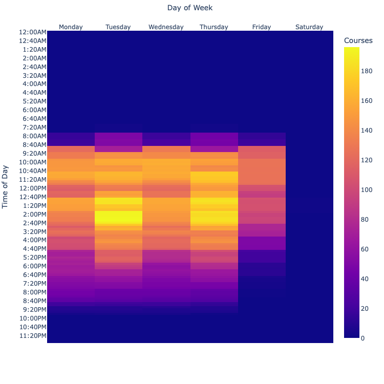
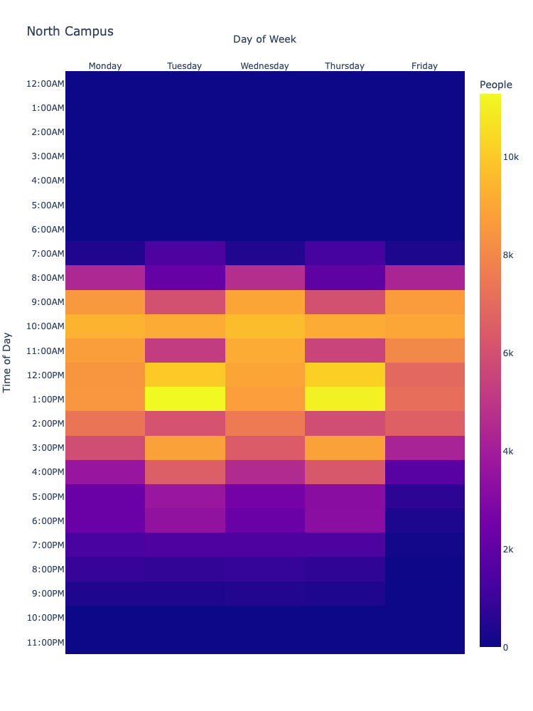

# ub_schedule_scraper
> Scrapes the SUNY University At Buffalo's course schedules

## Table of Contents
* [General Info](#general-information)
* [Technologies Used](#technologies-used)
* [Features](#features)
* [Screenshots](#screenshots)
* [Setup](#setup)
* [Usage](#usage)
* [Room for Improvement](#room-for-improvement)
* [License](#license)

## General Information
- Started this project because of the difficulty of finding parking in the beginning of the semester on North Campus at UB
- Planned to plot the busiest times of the day based on the number of people enrolled in courses, to find an optimal time to get a parking spot on North Campus. 

## Technologies Used
- Python 3.9
- BeautifulSoup4 4.10
- Plotly 

## Features
- Get JSON with below information of all undergrad courses in each dept during a semester:
`Class,Course,Enrolled,Title,Section,Type,Days,Time,Room,Location,Instructor (*) additional instructors,Status`
- Plot a heatmap of courses during a week with different time intervals

## Screenshots
Undergraduate courses in session on North Campus during a week (Spring 2022)

People enrolled in undergraduate courses in session on North Campus during a week (Spring 2022)

## Setup
Pipenv is used to handle dependencies and virtual environments.
1. Clone the repo
2. In terminal, cd to local repo
3. Install [Pipenv](https://pipenv.pypa.io/en/latest/install/)
4. run `pipenv install` to install dependencies
5. Now you can run the python files

## Usage
* **ub_sched_scraper.py** gets the data from the website
* **ub_sched_data.py** saves the data in CSV, JSON, or Pickle
* **ub_sched_plot.py** plots data
* **Example:**
Scrape website with 4 processorsand save data in JSON file
`saveSchedDictJSON(semester="spring", processors=4)` 
Plot the number of courses with time interval of 10 minutes
`plotSched(countPeople=False, timeInterval=10)
`

## Room for Improvement

To do:
- Find and compare number of courses/people enrolled in different buildings on campus
- Include graduate courses
- Include South Campus
- Find number of remote classes
- GUI or website

## License
>You can check the full license [here](https://github.com/achen236/ub_schedule_scraper/blob/master/LICENSE)
>
This project is licensed under the terms of the MIT license.
